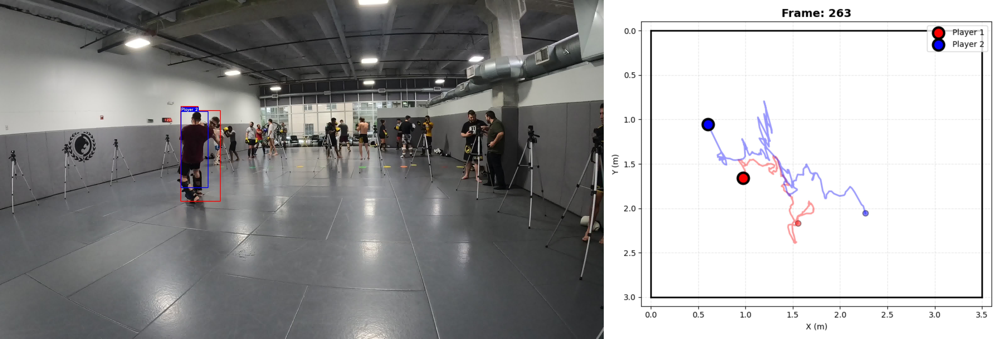

# MMA Player Detection and Tracking

YOLO 기반 MMA 선수 검출 및 추적 시스템



## 프로젝트 구조

```
MMA/
├── mma/                    # 모듈화된 패키지
│   ├── core/               # 설정, 상수, 예외 처리
│   ├── detection/          # YOLO 검출 + BBox 유틸
│   ├── tracking/           # Kalman, Re-ID, SORT, MMA 추적
│   ├── pose/               # 2D 자세 추정
│   ├── visualization/      # 시각화 도구
│   ├── preprocessing/      # 데이터셋 생성 및 분할
│   └── tests/              # 통합 테스트
├── script/                 # 유틸리티 및 학습 스크립트
│   ├── train/              # 모델 학습 스크립트
│   ├── visualizer/         # 시각화 스크립트
│   ├── smpl/               # 카메라 보정, 데이터 로딩
│   └── *.py                # 개별 유틸리티
├── config/                 # 설정 파일 (YAML)
├── dataset/                # 데이터셋
├── log/                    # 학습 로그
└── results/                # 결과 저장소
```

## 주요 기능

### 1. 검출 및 추적
- **YOLO 기반 검출**: YOLOv11x로 선수 검출
- **2-Player 추적**: Kalman 필터 + Re-ID 기반 하이브리드 추적
- **Singleton 패턴**: 모델 메모리 효율화 (~40% 절감)

### 2. 자세 추정
- YOLO Pose 모델로 2D 자세 추정
- COCO 17-keypoint 형식 지원

### 3. 데이터 전처리
- YOLO 형식 데이터셋 생성
- Train/Val/Test 자동 분할
- 시퀀스 기반 stratified 분할

### 4. 시각화
- 추적 결과 실시간 렌더링
- 스켈레톤 시각화
- 추적 ID 색상 관리

## 사용 예시

### 데이터셋 생성
```python
from mma.preprocessing import create_yolo_detection_dataset, split_yolo_dataset

# YOLO 데이터셋 생성
create_yolo_detection_dataset(
    'dataset/images/',
    annotations,
    'dataset/yolo_dataset/'
)

# Train/Val 분할
split_yolo_dataset(
    'dataset/yolo_dataset/',
    ratios={'train': 0.8, 'val': 0.2}
)
```

### 검출 및 추적
```python
from mma.detection import YOLODetector
from mma.tracking import MMATracker
from mma.core.config import DetectionConfig, TrackingConfig
import cv2

# 모델 로드
det_config = DetectionConfig(model_path='yolo11x.pt')
detector = YOLODetector(det_config)

trk_config = TrackingConfig(max_age=30)
tracker = MMATracker(trk_config)

# 추론
image = cv2.imread('frame.jpg')
detections = detector.detect(image)
tracks = tracker.update(image, detections, frame_num=1)
```

### 자세 추정
```python
from mma.pose import PoseEstimator, crop_person
from mma.core.config import PoseConfig

config = PoseConfig(model_path='yolo11x-pose.pt')
estimator = PoseEstimator(config)

crop, crop_info = crop_person(image, bbox, padding=0.1)
keypoints = estimator.estimate_pose(crop, bbox, crop_info)
```

### 시각화
```python
from mma.visualization import draw_bbox, draw_skeleton

image = draw_bbox(image, bbox, track_id=1, confidence=0.95)
image = draw_skeleton(image, keypoints, track_id=1)
```

## 환경 설정

```bash
# Conda 환경
conda create -n mma python=3.10
conda activate mma

# 패키지 설치
pip install -e .
```

## 참고

- **모듈화**: 5단계 모듈화 완료 (검출, 추적, 자세, 전처리, 시각화)
- **성능**: Re-ID 싱글톤으로 메모리 ~40% 절감, 초기화 10-20배 가속화
- **테스트**: 10+ 통합 테스트 포함

## 마이그레이션

기존 스크립트에서 모듈화 코드로 전환: [CLEANUP_SUMMARY.md](CLEANUP_SUMMARY.md) 참고
